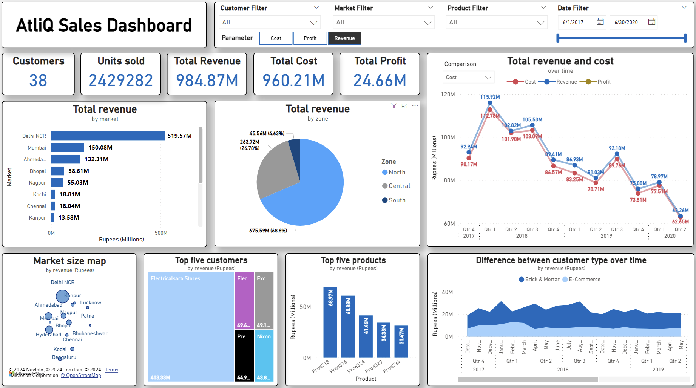

# Mini Project: AtliQ sales data analysis and dashboard visualization
`SQL`, `PowerBI` `Python`, `data manipulation`, `data analysis`, `data visualization`

**Read the pdf report `atliq_report.pdf` for a quick project summary**.

## A small data analysis project with SQL and PowerBI.

AtliQ is a B2B hardware & peripheral manufacturer headquartered in Mumbai, they have many regional branches across India. The company provides computer and network equipments for other businesses. In the previous quarter, the company was reported to have declining sales and their Sales director is having trouble tracking where business is falling in the local Indian market. We will help them to determine the issues by analyze and visualize their sales data.

Expected results:
- Provide an exploratory data analysis report.
- Provide a real-time dashboard to support data driven decision making.

Data analysis questions:
- Are there any trends on customer purchase behavior throughout the years?
- Is the any issues with certain products/markets/customers?
- What are the bottlenecks/problems that cause the decline in sales in certain markets?
- Any suggestions can be made to tackle found issues?

## Acknowledgement
- [`codebasics`](https://youtu.be/CCNd2fUfFkk) for problem statement and case explanation. 

## Project processes
- Step 1: **Data cleaning**: Using Python to clean data, then export them back 
- Step 2: **Exploratory analysis**: Using SQL to present the analysis.
- Step 3: **Data visualization**: Using PowerBI
- Step 4: **Report**: Present findings, answer case questions & suggestions.

## Dashboard features
*New dashboard in PowerBI from ver 2.0*
- Interactive dashboard changed based on filters & selection.
- Automatically update new data from database.
- Changable/Comparable observing parameters: Revenue, Cost and Price - Look the statistics for in different aspects.

